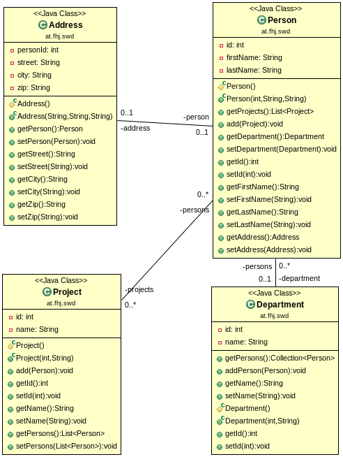

# jpa_demo
JPA demo project using in-memory database. Import as Maven project and run unit tests.

Relationships:
* OneToOne: Person - Address
* ManyToMany: Project - Person
* ManyToOne: Person - Department
* OneToMany: Department - Person
